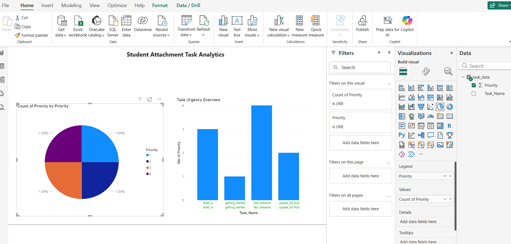

#  Priority Task Scheduler with Power BI Analytics

A Python-based scheduling application that uses a **Heap Queue** for efficient task management and **Pandas** to export real-time data for **Power BI** visualization.

## Features
* **Priority Management**: Uses Python's `heapq` for O(log n) task insertion.
* **Live Data Export**: Automatically updates a CSV file whenever tasks are modified.
* **Business Intelligence**: Integrated Power BI dashboard for workload analysis.

## Tech Stack
* **Language**: Python 3.14
* **Libraries**: Pandas, Tkinter, Heapq
* **Analytics**: Power BI Desktop Desktop

## Dashboard Preview

## Setup
1. Clone the repo: `git clone https://github.com/convincenemapare/priority-scheduler-pro`
2. Install dependencies: `pip install pandas`
3. Run the app: `python main.py`
